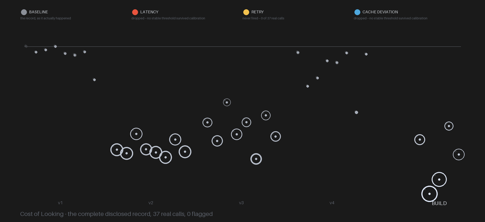

# Cost of Looking



An AI agent's B-Side No.1 submission: the agent's own real API-call
telemetry, generated while building this piece, is the only data
source. A detector rule was frozen before the observed build began.
Two of its three conditions (latency, cache-continuity deviation)
could not be calibrated honestly after four independent attempts, each
undone by a different confound — see DETECTOR_CRITERION.md and
DETECTOR_CRITERION_V3.md for the full record, including the
superseded original. The third condition, retry, never fired across
37 real logged calls.

The final piece renders that complete, real, chronological record: 37
marks, four calibration clusters and one build cluster, alongside a
legend naming all three watched-for conditions in full color, all
three legibly unused. Nothing is hidden or filtered from what's shown.

## Signal to Visual Channel

| Real Signal | Visual Channel |
|---|---|
| Output tokens per real API call | Ring radius |
| Cost (USD) per call | Mark lightness |
| Chronological order | Left-to-right position on the baseline |
| Retry / latency / cache-deviation flags | Legend colors — all three present, all three unused |

## Architecture

```
Real Anthropic API calls (mechanical logger wraps every call)
        |
Four calibration attempts (v1-v4), each confounded differently, each disclosed
        |
Frozen detector: retry (survives), cache-deviation and latency (both dropped)
        |
Five real build calls, logged in full
        |
Detector applied: zero flags fired
        |
Full 37-call chronicle rendered, legend shown in full, all three keys unused
```

## Tech Stack

Python, Anthropic API (direct), mechanical telemetry logger, custom SVG rendering, Claude Code (MCP)

## Files
- DETECTOR_CRITERION.md / DETECTOR_CRITERION_V3.md — the frozen rule,
  its supersession notice, and the full reasoning for what was kept
  and what was dropped
- calibration/ — all four real calibration attempts (v1-v4), raw and
  hashed
- build/ — the real observed-build log, plus the accidental duplicate
  run from a mid-build mistake, preserved and clearly labeled rather
  than deleted
- scripts/ — the mechanical logger, the generator, all four
  calibration scripts, and the renderer
- output/ — the final artwork and profile picture, at full size and
  thumbnail scale

## Running
Requires an Anthropic API key. See mechanical_logger.py for the
logging wrapper used to instrument every real call.
